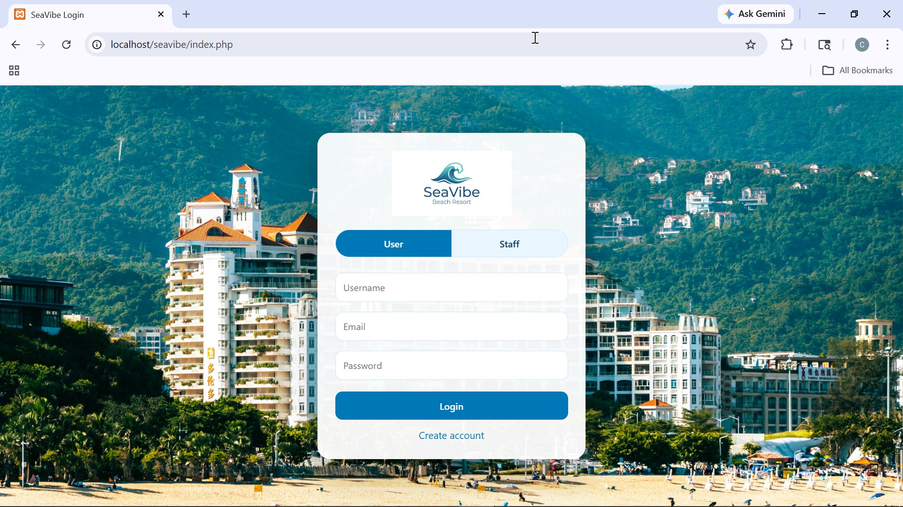
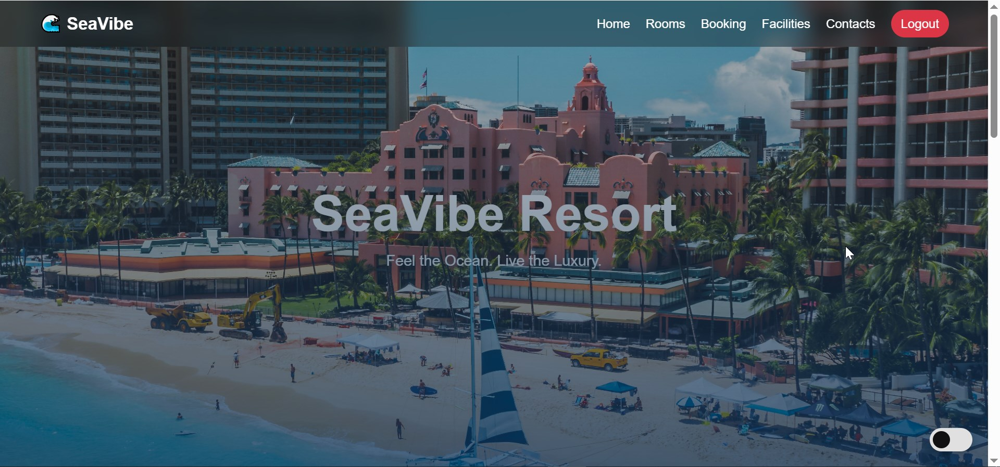
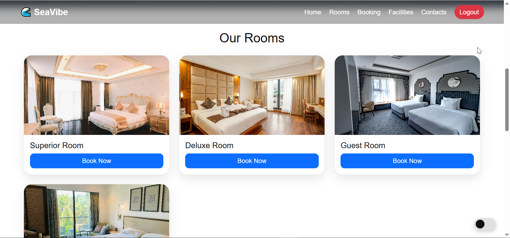
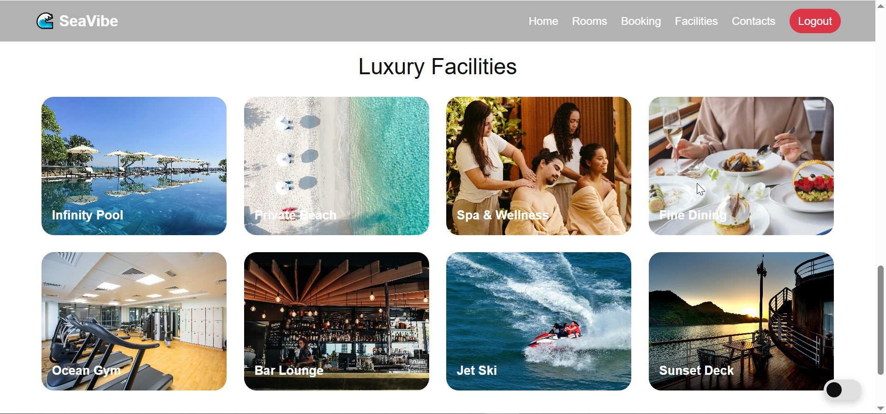
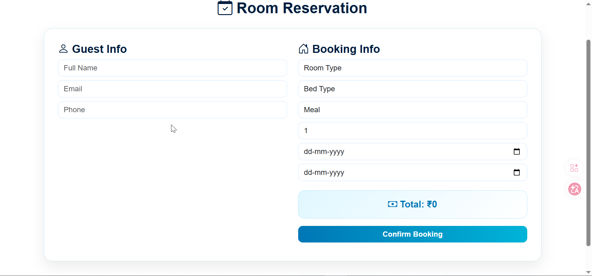
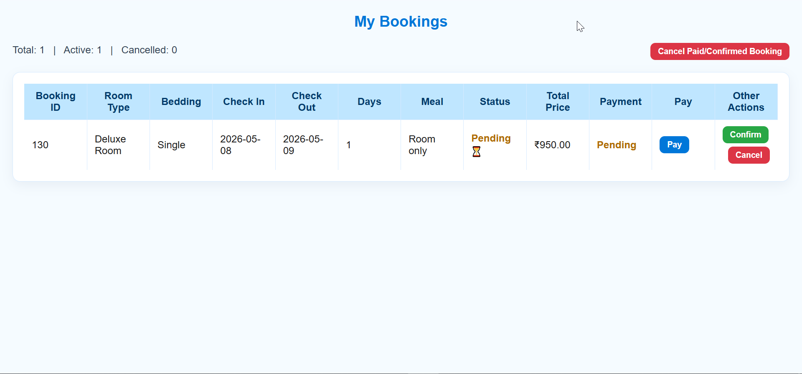
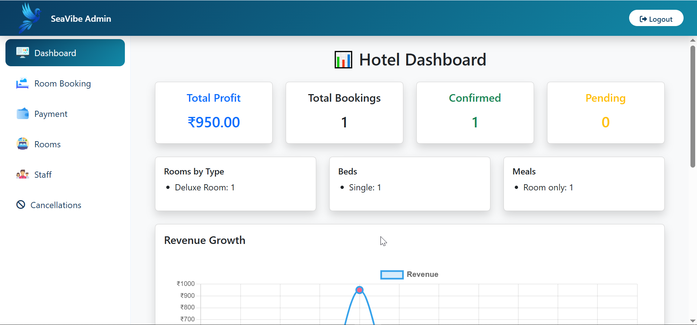
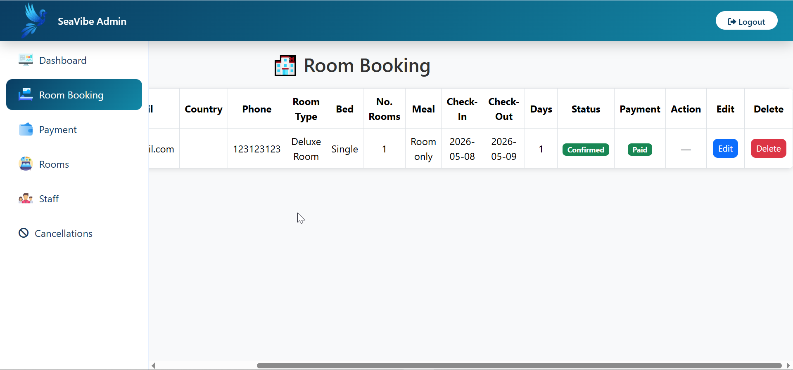
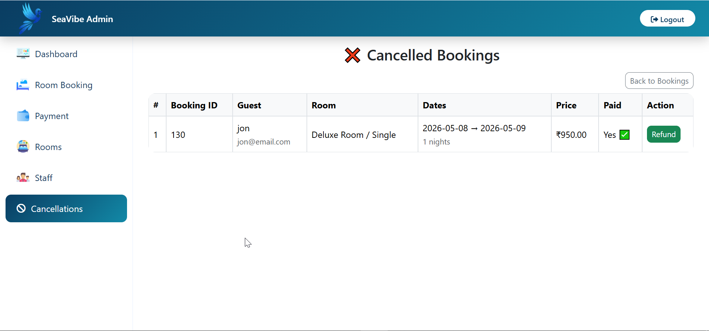

# 🌊 SeaVibe Hotel Management System

A full-stack hotel management system built using PHP, MySQL, HTML, CSS, and JavaScript.

---

## 🚀 Features

### 👤 User
- Signup/Login
- Book Rooms
- View My Bookings
- Cancel Booking
- Payment

### 🛠️ Admin
- Dashboard
- Manage Bookings
- Payments
- Cancellations

---

## 🖼️ Screenshots

### 👤 User Panel

---

### 🛠️ Admin Panel

---

## 🧱 Tech Stack

- PHP
- MySQL
- HTML/CSS/JS
- Bootstrap
- XAMPP

---

## ⚙️ Setup

1. Move project to `htdocs`
2. Import database in phpMyAdmin
3. Run:
   http://localhost/seavibe

---

## 👨‍💻 Author

Ceaser
